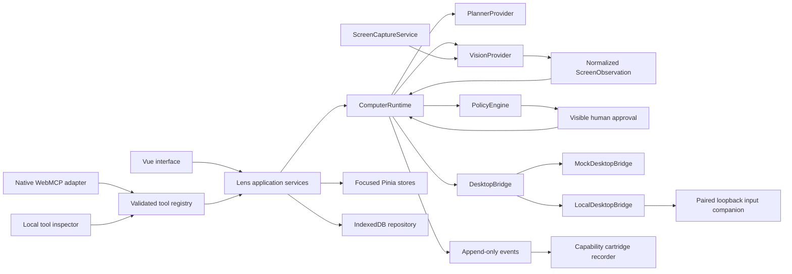
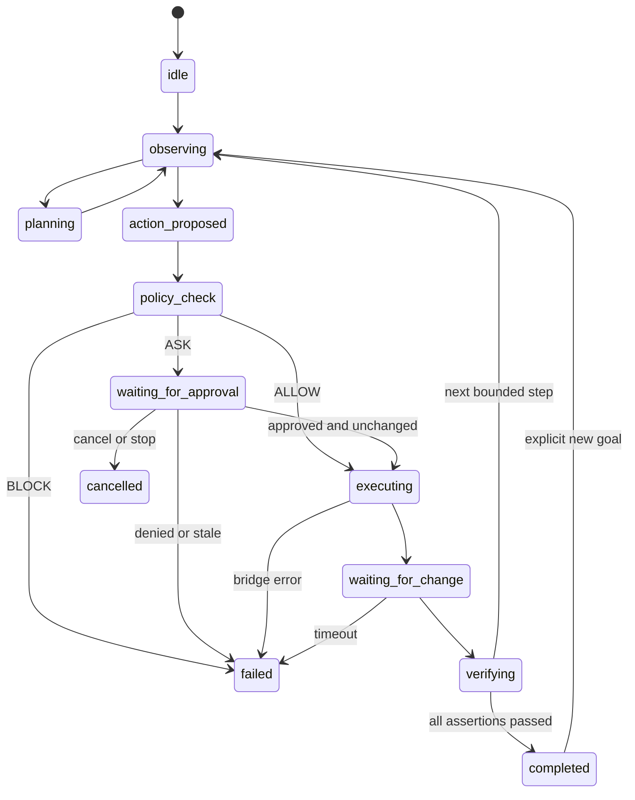

# Architecture

Lens runs its application in the browser. The native companion only authenticates a browser session, validates bounded commands and emits operating-system input. HTTP is the local companion transport, not a web application backend.

## Runtime

Cancellation can interrupt every active state. Abort checks run after awaited operations and before bridge input. No commands are queued. Concurrent goals fail. Plans contain at most 100 steps. Each state transition becomes a durable event; model reasoning text is neither required nor exposed.

`ComputerRuntime` accepts a `DesktopBridge`, `PlannerProvider`, policy engine and observation/state hooks. `LensService` composes those services and updates Pinia. The mock desktop responds to the same six command variants as Windows. The demo planner only accepts its supported scenarios. Assertions use semantic fixture state; live manual actions only claim that a pixel change occurred.

## Coordinates and observation

Fixtures define semantic regions in normalized 0..1 coordinates. `screen/coordinates.ts` converts capture pixels to normalized coordinates, resolves region centers, and maps them into physical desktop bounds. Negative monitor origins are valid. Width and height are already physical pixels, so display scale is not multiplied twice. Windows requests per-monitor DPI awareness and reports its virtual desktop bounds.

Live capture samples a 128 by 72 RGBA image on a configurable timer with a 100 ms minimum interval. A timer also detects changes in otherwise static capture streams. Global and regional RGB differences compare with the last significant frame. A candidate change increments the live revision. Full frames are available through `captureFrame()` for a future provider; no bundled provider sends pixels anywhere.

`VisionProvider` returns `ScreenObservation`, independent of any vendor response format. `MockVisionProvider` reads deterministic fixtures and reports `fixture`. `RemoteVisionProvider` is the future integration contract. Live sessions report `unavailable` until a real provider is added. Fixture regions never overlay a live screen.

## Persistence and workflows

`Repository` is the only IndexedDB adapter. It stores settings, sessions, immutable event inserts and cartridges. Pinia is reactive state, not a persistence or execution engine. Monotonic ULIDs preserve event order, including multiple transitions within a millisecond. Store failures produce a visible notice and retain the current in-memory event log.

Recording keeps successful Lens actions and human annotations. It does not intercept global OS input. Cartridges use validated declarative steps and plain string variables. Compilation produces an ordinary `GoalPlan`; it cannot run JavaScript, open arbitrary URLs, read files or define bridge message types. Replay follows current policy, not a recording's old permission. History is read-only and never resumes control.

## Responsibility map

| Directory                        | Owns                                                             |
| -------------------------------- | ---------------------------------------------------------------- |
| `app`                            | Service composition, routing, styles                             |
| `pages`, `components`            | Human controls and operational state                             |
| `screen`, `vision`               | Capture, change detection, coordinates, normalized observations  |
| `runtime`, `policy`              | Bounded state machine, planning and authorization decisions      |
| `bridge`                         | Browser transport adapters                                       |
| `webmcp`                         | Tool schemas, invocation receipts, feature detection and cleanup |
| `workflows`                      | Recording, validation and compilation                            |
| `stores`, `persistence`, `types` | Reactive state, storage and environment types                    |

The implementation progressed through a working mock runtime, capture, tools, native bridge and cartridges. Build checks ran between these passes.

## Documentation and project overview

`/webmcp` reads the existing ToolRegistry through `content/toolDocs.ts`. Editorial notes add prompts and recovery advice without creating a second registry. `/hackathon` uses the same tool count and shared content for workflows, verified project URLs and the recording script. Route metadata updates in the router hook. Neither page owns control authorization, native registration or application state. The former `/tools` route redirects to `/webmcp`.
